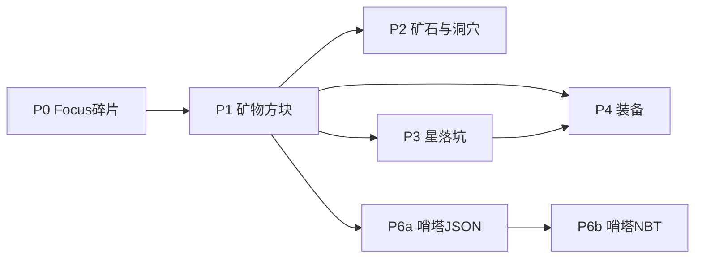

# 辉石世界线 — 索引（不要一次全做）

现有法术包：12 个辉石咒 + 学派 `elden_ring_spells:glintstone` + 三色碎片 Focus（P0 已完成）。世界侧补矿石、水晶、水晶块与生成。

**对 Agent：不要执行本文件。打开下面某一个子 plan，只做那一份，验收通过后停。**

| 顺序 | 子 plan | 一次会话 | 依赖 |
|------|---------|----------|------|
| 0 | [P0 Focus 碎片](辉石世界线_P0_Focus碎片.plan.md) | 代码 | 无（已完成） |
| 1 | [P1 三色矿物方块](辉石世界线_P1_三色晶体与晶洞.plan.md) | 代码 | P0 |
| 2 | [P2 矿石与辉石矿洞](辉石世界线_P2a_矿洞数据包.plan.md) | 代码 | P1 |
| ~~2b~~ | [P2b 已取消](辉石世界线_P2b_矿洞NBT.plan.md) | — | — |
| 3 | [P3 星落坑](辉石世界线_P3_星落坑.plan.md) | 代码 | P1（可与 P2 并行） |
| 4 | [P4 粉尘与装备](辉石世界线_P4_粉尘与装备.plan.md) | 代码 | P0；粉尘依赖 P1；陨石杖依赖 P3 |
| 6a | [P6a 哨塔数据包](辉石世界线_P6a_哨塔数据包.plan.md) | 代码 | P1 |
| 6b | [P6b 哨塔 NBT](辉石世界线_P6b_哨塔NBT.plan.md) | 进游戏搭 | P6a |

阶段 5（自定义敌人）已取消。P2b jigsaw 矿洞 NBT 已取消。

---

## 总原则（所有子 plan 共用）

- 造卷轴继续走铁魔法：纸 + 墨水 + 辉石碎片（Focus）。不另开造咒台，不做「辉石墨水」。
- 一个学派，三种颜色矿，统一叫「X色辉石」，不要「学院辉石 / 卡利亚辉石」这种派系名。
- **青 / 蓝 / 紫共享一套代码，不生长**（无 budding、无随机刻长大）。
- **不做独立 geode，不做 jigsaw 辉石矿洞。** 地下辉石来自：① 原版式矿石矿脉；② 现成洞穴上的「辉石矿洞」Feature（整片洞穴表面刷同色水晶/水晶块，三色等概率、一洞一色）。星落坑是地表陨石坑（主要铺紫色），不是晶洞。
- **不做建材**（砖、抛光、灯）于本轮；以后另开。
- 辉石只从世界生成与战利品获取。**不做**用紫水晶、青金石等原版材料合成辉石的配方。
- 结构挂原版群系，**不加新群系**。明确不做：学院本体、卡利亚城寨、瑟利亚、夜术镇。
- **本模组任何结构建筑都不刷新、不放置任何生物。** NBT/Feature 不放刷怪笼、不放实体；jigsaw 用 `spawn_overrides` 清空各类别。不写 `AbstractSpellCastingMob`、不注册刷怪蛋。
- 常量进 `tuning/GlintstoneWorldTuning.java`。贴图走 `工具链/`，画布 32×32。水晶块用 `cube_all`，不建模。
- 每个阶段结束：`compileJava` 通过 + 创造栏能看见新内容 + 双语 lang。完成后在 [AGENTS.md](../../AGENTS.md)「已知状态」勾一项。
- 每个阶段只提交该阶段文件，不顺手重构法术渲染。

## 明确不在本轮

- 新群系 / 辉石湖、雷亚卢卡利亚本体、卡利亚、瑟利亚、夜术、重力咒包
- 用原版材料合成辉石、第二套墨水、自定义法术书整页
- 发芽块 / 会生长的晶体；辉石砖 / 抛光 / 灯等建材
- 独立 geode Feature、jigsaw 矿洞结构与 NBT
- 自定义生物；任何结构内刷怪笼或刷新生物
