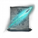
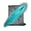
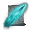
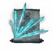
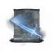
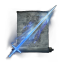
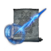
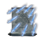

# Iron's Spells 'n Spellbooks: Elden Ring（Iron的法术与魔法书：艾尔登法环）

Minecraft **1.21.1** / **NeoForge** 扩展模组。依赖 [Iron's Spells 'n Spellbooks](https://iron.wiki/developers/)，在铁魔法施法管线上加《艾尔登法环》风格法术、辉石学派、装备与地下辉石矿洞 / 观星台。

模组 ID：`iss_elden_ring`  
当前版本：`1.0.0`

> 这不是独立魔法系统。按键、扣蓝、冷却、法术书仍走铁魔法；本模组只补「出手之后干什么」。

## 需要什么

| 组件 | 版本 |
|------|------|
| Minecraft | 1.21.1 |
| NeoForge | ≥ 21.1.200（开发编译用 21.1.248） |
| JDK | **21**（不要用 24） |
| Iron's Spells 'n Spellbooks | 1.21.1-3.16.1 及以上 |
| Iron's Spellbooks Lib | 1.21.1-1.1.0 及以上（对齐 3.16.1） |

运行时还会拉 Curios、GeckoLib、PlayerAnimator（铁魔法自己的依赖）。把本模组 jar 和铁魔法一起放进 `mods/` 即可。

### 可选：Apotheosis x Iron's Spellbooks Compat

无兼容模组可正常游玩。完整施法向词缀 / 宝石加成请装 [Apotheosis x Iron's Spellbooks Compat](https://www.curseforge.com/minecraft/mc-mods/apotheosis-x-irons-spellbooks-compat)（内部 ID `irons_apothic`），并连带其依赖的 [Apotheosis](https://www.curseforge.com/minecraft/mc-mods/apotheosis) **≥ 8.5.2**。

本模组通过 datapack 往 `irons_apothic` 挂辉石学派：法术强度、蓝耗减免、法术等级词缀，以及「辉石棱晶」宝石。仅装神化本体时，护甲仍可参与神化重铸；杖 / 魔法书的施法词缀需要上述兼容模组。

---

## 内容一览

### 辉石学派与抄写材料

独立学派 `iss_elden_ring:glintstone`（显示名「辉石」），带自己的法术强度 / 抗性属性和伤害类型。

三色辉石碎片 / 起源辉石是学派触媒（Focus）：放进铁魔法**卷轴锻造台**的焦点槽抄写卷轴（取出成品时消耗焦点）。不同材料只能抄对应咒：

| 焦点 | 图标 | 可抄范围 |
|------|------|----------|
| 青色辉石碎片 |  | 学院弹道、星光、魔法之境、海摩等 |
| 蓝色辉石碎片 |  | 卡利亚近战、辉剑 / 圆阵 |
| 紫色辉石碎片 |  | 重力球、碎星 |
| 起源辉石 |  | 毁灭流星、创星雨、彗星亚兹勒 |

碎片可从地下辉石矿洞、观星台箱子、观星者交易获得；9 个碎片 ↔ 1 个同色辉石水晶块（可来回拆合）。

起源辉石获取：

- 普通模式：炼金锅用起源晶体 + 粗制药水炼成起源药剂 → 饮用后死亡，原地留下悬浮起源辉石
- **极限模式**：观星者直接出售（1 下界之星 + 64 绿宝石 → 1 起源辉石），避免极限下无法回档

卷轴用铁魔法通用卷轴物品，外观按法术切到本模组贴图。创造栏「艾尔登法环法术」里能拿到碎片、水晶和对应卷轴。

### 追踪排除（按键）

默认 **按住 X + 按下 C** 打开「辉石追踪排除」菜单（可在「控制」里改键）：可勾选不追踪玩家 / 和平 / 中立 / 敌对生物。

---

## 配方

下列配方均来自 `src/main/resources/data/iss_elden_ring/recipe/`。形状以游戏内 JEI / 工作台为准；这里只列材料与来源，不画易错的手写格子。

### 材料

| 产物 | 图标 | 配方文件 | 材料 |
|------|------|----------|------|
| 起源晶体 |  | `origin_crystal.json` | 8×辉石水晶簇（`#iss_elden_ring:glintstone_clusters`）+ 1×下界之星 |
| 辉石符文 |  | `glintstone_rune.json` | 8×辉石碎片（`#iss_elden_ring:glintstone_shards`）+ 1×`irons_spellbooks:blank_rune` |
| 辉石升级法球 |  | `glintstone_upgrade_orb.json` | 8×辉石符文 + 1×`irons_spellbooks:upgrade_orb`（镶嵌后辉石强度 +5%） |
| 起源药剂 |  | `alchemist_cauldron/brew_origin_potion.json` | 炼金锅：粗制药水 + 起源晶体 → 装瓶 |

三色碎片 ↔ 同色水晶块：`*_glintstone_block.json` / `*_glintstone_shard_from_block.json`（9 碎 ↔ 1 块）。

### 法杖与魔法书

| 产物 | 图标 | 效果 | 配方文件 | 材料 |
|------|------|------|----------|------|
| 观星杖 |  | 主手施法；辉石强度 +10% | `astrologer_staff.json` | 4×辉石碎片（`#iss_elden_ring:glintstone_shards`）+ 1×`irons_spellbooks:arcane_ingot` + 2×木棍（`#c:rods/wooden`） |
| 亚兹勒的辉石杖 |  | 辉石 +10%；吟唱 -15%；蓝耗 ×1.20 | `azur_glintstone_staff.json` | 6×青色辉石碎片 + 1×起源晶体 + 1×观星杖 + 1×`irons_spellbooks:arcane_ingot` |
| 星星法典 |  | 10 槽；辉石 +10%、最大法力 +200 | `star_codex.json` | 4×辉石碎片 + 2×`irons_spellbooks:arcane_ingot` + 1×`irons_spellbooks:ruined_book` |
| 起源秘典 |  | 12 槽；辉石 +25%、最大法力 +300 | `origin_codex.json` | 5×`irons_spellbooks:arcane_ingot` + 1×起源晶体 + 2×`irons_spellbooks:magic_cloth` + 1×星星法典 |

亚兹勒杖数值在 `iss_elden_ring-server.toml` → `equipment.azur_staff`：`castTimeReduction` 默认 `0.15`，`manaCostMultiplier` 默认 `1.20`。持续施法按铁魔法规则延长持续时间，不加速脉冲，也不缩短彗星亚兹勒自定义预热。

观星杖也可从观星者处购买（概率）；星星法典同理。

### 星辰法师套装

每件：护甲值对齐铁魔法学派护甲；+125 最大法力；+10% 辉石强度；+5% 通用法术强度。长袍额外 1 个可灌注法术槽。材料均为 `irons_spellbooks:magic_cloth` + 辉石符文。

| 部位 | 图标 | 配方文件 |
|------|------|----------|
| 宽檐帽 |  | `celestial_mage_hat.json` |
| 长袍 |  | `celestial_mage_robe.json` |
| 护腿 |  | `celestial_mage_leggings.json` |
| 长靴 |  | `celestial_mage_boots.json` |

观星者套装属性与星辰法师相同，为观星者 NPC 默认穿着，**暂不可制作**、不进创造栏。

### 护符（Curios charm 槽）

| 物品 | 图标 | 效果 | 获取 |
|------|------|------|------|
| 魔法师球 |  | 法术强度 +5% | `mage_sphere.json`：3×青 + 2×蓝 + 2×紫碎片 + 1×`irons_spellbooks:arcane_ingot`；或观星台塔顶箱子 |
| 源辉石刀 |  | 蓝耗 -25%；最大生命 -15%；法术攻击 +7% | 无合成配方；观星者出售（32–64 绿宝石） |

---

## 法术（27）

图标为游戏内法术图标。卷轴外观见 `textures/item/*_scroll.png`。

### 辉石弹道

| | 法术 | 大致手感 | 抄写焦点 |
|---|------|----------|----------|
|  | 辉石魔砾 | 基础单发，限角追踪 | 青 |
|  | 辉石迅魔砾 | 更快更便宜，单发更弱 | 青 |
|  | 辉石大魔砾 | 大体积弹，命中小范围爆炸 | 青 |
|  | 辉石彗星 | 介于大魔砾与帚星之间 | 青 |
|  | 辉石流星 | 三发错峰强追踪 | 青 |
|  | 流星雨 | 六发错峰强追踪 | 青 |
|  | 毁灭流星 | 长吟唱后八发齐射 | 起源 |
|  | 帚星 | 巨型彗星，大半径爆炸 | 青 |
|  | 旋飞魔砾 | 双螺旋弹道，可穿透 | 青 |
|  | 辉石弯弧 | 横向青色穿透刃，不追踪 | 青 |
|  | 结晶连弹 | 按住散射碎片；可缓慢走动 | 青 |
|  | 结晶散射 | 瞬时齐射，可移动施法 | 青 |

### 持续 / 场地

| | 法术 | 大致手感 | 抄写焦点 |
|---|------|----------|----------|
|  | 星光 | 头顶跟随小星，火把级照明 | 青 |
|  | 魔法之境 | 脚下法阵，站内法术强度 +30% | 青 |
|  | 彗星亚兹勒 | 蓄力后按住喷流；可缓慢走动 | 起源 |
|  | 创星雨 | 星云升空后落下雨针 | 起源 |

### 近战 / 卡利亚 / 海摩

| | 法术 | 大致手感 | 抄写焦点 |
|---|------|----------|----------|
|  | 海摩大槌 | 身前巨锤砸地，直击 + 冲击波 | 青 |
|  | 海摩炮弹 | 蓄力抛出抛物线炮弹 | 青 |
|  | 卡利亚迅剑 | 点按第一刀，长按交替斩击 | 蓝 |
|  | 卡利亚大剑 | 同迅剑节奏的大剑斩 | 蓝 |
|  | 卡利亚贯刺 | 点按突刺一次 | 蓝 |
|  | 魔法辉剑 | 身前悬停后追踪飞出 | 蓝 |
|  | 辉剑圆阵 | 头上五把跟手辉剑，附近有敌人自动射出 | 蓝 |
|  | 卡利亚圆阵 | 九把；与另外两圈圆阵互斥 | 蓝 |
|  | 巨剑阵 | 三把放大辉剑；与另外两圈圆阵互斥 | 蓝 |

### 重力

| | 法术 | 大致手感 | 抄写焦点 |
|---|------|----------|----------|
|  | 重力球 | 直线紫球，无伤害；命中后把敌人拉向施法者 | 紫 |
|  | 碎星 | 锥面散射多发重力球，拉取距离随等级变长 | 紫 |

起源系法术伤害类型为**魔法伤害**（非独立起源伤害）。

---

## 世界

### 辉石矿洞

地下洞穴表面会刷三色辉石矿物：水晶块 + 完整水晶簇。一洞一色、不生长、没有矿石矿脉，也不新挖空洞。密度在 `config/iss_elden_ring-common.toml`。

| 青色 | 蓝色 | 紫色 |
|------|------|------|
|   |   |   |

### 观星台（星象观测台）

地表会生成观星台结构（法环风格魔法师塔）。内有宝箱（辉石碎片、墨水、铁魔法材料等）；**塔顶箱子**额外有概率掉落魔法师球，以及本模组辉石卷轴。

观星者 NPC 会生成在观星台中：出售三色碎片、普通辉石卷轴、源辉石刀，以及概率出售观星杖 / 星星法典；极限模式额外售起源辉石。

尚未实现：地表星落坑、辉石粉尘装备、学院哨塔。

---

## 配置

进存档后生成：

| 文件 | 改什么 |
|------|--------|
| `config/iss_elden_ring-server.toml` | 伤害、蓝耗、弹速、转向、爆炸半径、亚兹勒杖 / 源辉石刀等玩法数字。整合包改这里，不用重编译。 |
| `config/iss_elden_ring-common.toml` | 辉石矿洞密度与扫描高度。改完要新区块或新世界才看得到。 |
| `config/irons_spellbooks_spell_config/iss_elden_ring/<法术id>.json` | 冷却、最大等级、法术开关（铁魔法自己的配置）。 |

视觉（粒子密度、动画、握点）写死在代码里，不进 toml。

---

## 构建

必须用 JDK 21 和仓库自带的 Gradle Wrapper，不要用系统全局 Gradle。

```powershell
$env:JAVA_HOME = "C:\Program Files\Microsoft\jdk-21.0.12.8-hotspot"
$env:PATH = "$env:JAVA_HOME\bin;$env:PATH"
.\gradlew.bat compileJava
.\gradlew.bat build
.\gradlew.bat runClient
```

产物：`build/libs/iss_elden_ring-1.0.0.jar`

装备回归测试使用独立 GameTestServer，不操作玩家存档：

```powershell
.\gradlew.bat -I .\工具链\equipment-gametest.init.gradle runGameTestServer
```

测试源码和空场景位于 `src/gametest`，仅在这条开发命令中加载；脚本也明确将它们排除在 JAR 之外。模型结构可用 `node 工具链/validate_staff_models.mjs` 验证。

国内网络已配阿里云镜像。NeoForge 下载失败可重试：

```powershell
.\gradlew.bat build --refresh-dependencies
```

---

## 给协作者 / AI

改代码前先读这些，不要只靠这份 README：

- **[代码阅读路径.md](./代码阅读路径.md)** — 从哪个文件点进去、下一份打开谁
- **[AGENTS.md](./AGENTS.md)** — 技术栈、目录、加法术流程、命令与约束
- **[法术解耦架构.md](./法术解耦架构.md)** — Spell / Curve / Combat / Fx 拆分，以及数字写到哪
- **[.cursor/rules/elden-ring-spells.mdc](./.cursor/rules/elden-ring-spells.mdc)** — Cursor 常驻规则

卡利亚迅剑抬臂仍有未完成项，接着改动作前先读 **[卡利亚迅剑话题交接.md](./卡利亚迅剑话题交接.md)**。

近期玩家向变更摘要见 [`update_logs/`](./update_logs/)。

## 许可证

All Rights Reserved。
