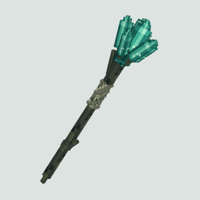

# Iron's Spells 'n Spellbooks: Elden Ring（Iron的法术与魔法书：艾尔登法环）

Minecraft **1.21.1** / **NeoForge** 扩展模组。依赖 [Iron's Spells 'n Spellbooks](https://iron.wiki/developers/)，在铁魔法施法管线上加《艾尔登法环》风格法术、辉石学派与地下辉石矿洞。

模组 ID：`elden_ring_spells`（内部 ID，勿随意改）  
当前版本：`1.0.0`

> 这不是独立魔法系统。按键、扣蓝、冷却、法术书仍走铁魔法；本模组只补「出手之后干什么」。

# 构建此项目
```bash
$env:JAVA_HOME = "C:\Program Files\Microsoft\jdk-21.0.12.8-hotspot"
$env:PATH = "$env:JAVA_HOME\bin;$env:PATH"
.\gradlew.bat build

```


## 需要什么

| 组件 | 版本 |
|------|------|
| Minecraft | 1.21.1 |
| NeoForge | ≥ 21.1.200（开发编译用 21.1.248） |
| JDK | **21**（不要用 24） |
| Iron's Spells 'n Spellbooks | 1.21.1-3.16.2 及以上 |
| Iron's Spellbooks Lib | 1.21.1-2.1.0 及以上 |

运行时还会拉 Curios、GeckoLib、PlayerAnimator（铁魔法自己的依赖）。把本模组 jar 和铁魔法一起放进 `mods/` 即可。

## 内容

### 辉石学派

独立学派 `elden_ring_spells:glintstone`（显示名「辉石」），带自己的法术强度 / 抗性属性和伤害类型。

辉石碎片 / 起源辉石是学派触媒（Focus），放进铁魔法卷轴锻造台的焦点槽抄写卷轴（取出成品时消耗焦点）。不同材料只能抄对应咒，不是整校通用：

| 焦点材料 | 可抄范围（概要） |
|----------|------------------|
| 青色辉石碎片 | 学院弹道、星光、魔法之境、海摩等 |
| 蓝色辉石碎片 | 卡利亚近战、辉剑 / 圆阵 |
| 紫色辉石碎片 | 重力球、碎星 |
| 起源辉石 | 毁灭流星、创星雨、彗星亚兹勒 |

完整映射见代码 `GlintstoneScrollRecipes`。卷轴用铁魔法通用卷轴物品，外观按法术切到本模组贴图。创造栏「艾尔登法环法术」里能拿到碎片、水晶和对应卷轴。

### 魔法书

| 物品 | 效果 |
|------|------|
| 星星法典 | 10 个法术槽；辉石法术强度 +15%、最大法力 +250；稀有品质 |
| 起源秘典 | 12 个法术槽；辉石法术强度 +35%、最大法力 +400；史诗品质 |

### 装备进阶

以下配方仅使用原版、铁魔法与本模组材料，保留现有法术和起源药剂机制。

| 装备 | 获取方式 |
|------|----------|
| 观星杖 | 工作台：青色辉石碎片、金锭、铁锭各 1，木棍 2 |
| 星星法典 | 锻造台：稀有墨水（模板槽）+ 附魔魔法书（基底槽，`irons_spellbooks:diamond_spell_book`）+ 青色辉石块（添加物槽） |
| 起源秘典 | 锻造台：传说墨水 + 星星法典 + 起源晶体 |
| 亚兹勒的辉石杖 | 锻造台：史诗墨水 + 观星杖 + 起源晶体 |

锻造升级继承原装备的名称、附魔和组件，包括法术的等级、槽位、锁定状态、已购买的额外槽位和升级标记。书籍容量取原书已扩容容量与目标书基础容量的较大值；不会把 14 槽星星法典升级后截成 12 槽。为避免铁魔法普通锻造重建容器时丢失高位法术，三个配方使用本模组 `equipment_upgrade` 序列化器，仍归属于标准锻造台配方类型。

起源晶体已有「8 个辉石晶簇 + 下界之星」配方，构成高阶装备的凋灵阶段门槛。装备升级无需饮用致死药剂，极限模式也可完成。起源辉石仍可作为高阶法术触媒，原有药剂、死亡掉落与战利品逻辑没有改动。

两根法杖均以主手为有效栏位，保留辉石法术强度 +10%。亚兹勒杖额外提供铁魔法原生吟唱属性 +15%，代价为消耗法力的施法费用增加 20%（向上取整）。普通吟唱缩短；持续施法遵循铁魔法原生规则延长持续时间，不加速脉冲，也不缩短彗星亚兹勒自定义的预热时间。免费卷轴/重施和创造模式原有免蓝设置继续生效。开始施法后换掉亚兹勒杖不会免除这次已获得加速的费用。

亚兹勒杖的新增数值在 `elden_ring_spells-server.toml` 的 `equipment.azur_staff` 下配置：`castTimeReduction` 默认 `0.15`，`manaCostMultiplier` 默认 `1.20`。玩家登录和服务器热重载时同步这两个值，主手属性与客户端蓝耗预览随之更新。书籍基础槽数、辉石和法力加成集中定义在 `EldenRingServerConfig` 的装备常量中，调整它们需要重编译。

法杖使用原版方块物品模型和 32×32 贴图；可编辑源文件保存在 `模型/*.bbmodel`。下图为 Blockbench 物品栏预览，不代表游戏内动画或光影验收。

| 观星杖 | 亚兹勒的辉石杖 |
|--------|----------------|
|  |  |

### 法术（27）

**辉石弹道**

| 法术 | 大致手感 |
|------|----------|
| 辉石魔砾 | 基础单发，限角追踪 |
| 辉石迅魔砾 | 更快更便宜，单发更弱 |
| 辉石大魔砾 | 大体积弹，命中小范围爆炸 |
| 辉石彗星 | 介于大魔砾与帚星之间 |
| 辉石流星 | 三发错峰强追踪 |
| 流星雨 | 六发错峰强追踪 |
| 毁灭流星 | 长吟唱后八发齐射 |
| 帚星 | 巨型彗星，大半径爆炸 |
| 旋飞魔砾 | 双螺旋弹道，可穿透 |
| 辉石弯弧 | 横向青色穿透刃，不追踪 |
| 结晶连弹 | 按住散射碎片，不能边走边放 |
| 结晶散射 | 瞬时齐射，可移动施法 |

**持续 / 场地**

| 法术 | 大致手感 |
|------|----------|
| 星光 | 头顶跟随小星，火把级照明 |
| 魔法之境 | 脚下法阵，站内法术强度 +30% |
| 彗星亚兹勒 | 蓄力后按住喷流 |
| 创星雨 | 星云升空后落下雨针 |

**近战 / 卡利亚**

| 法术 | 大致手感 |
|------|----------|
| 海摩大槌 | 身前巨锤砸地，直击 + 冲击波 |
| 海摩炮弹 | 蓄力抛出抛物线炮弹 |
| 卡利亚迅剑 | 点按第一刀，长按交替斩击 |
| 卡利亚大剑 | 同迅剑节奏的大剑斩 |
| 卡利亚贯刺 | 点按突刺一次 |
| 魔法辉剑 | 身前悬停后追踪飞出 |
| 辉剑圆阵 | 头上五把跟手辉剑，附近有敌人自动射出 |
| 卡利亚圆阵 | 九把；与另外两圈圆阵互斥 |
| 巨剑阵 | 三把放大辉剑；与另外两圈圆阵互斥 |

**重力**

| 法术 | 大致手感 |
|------|----------|
| 重力球 | 直线紫球，无伤害；命中后把敌人拉向施法者 |

### 世界

地下洞穴表面会刷三色辉石矿物：水晶块 + 完整水晶簇。一洞一色、不生长、没有矿石矿脉，也不新挖空洞。密度在 `config/elden_ring_spells-common.toml`。

地表星落坑、辉石粉尘装备、学院哨塔还没做。

## 配置

进存档后生成：

| 文件 | 改什么 |
|------|--------|
| `config/elden_ring_spells-server.toml` | 伤害、蓝耗、弹速、转向、爆炸半径等玩法数字。整合包改这里，不用重编译。 |
| `config/elden_ring_spells-common.toml` | 辉石矿洞密度与扫描高度。改完要新区块或新世界才看得到。 |
| `config/irons_spellbooks_spell_config/elden_ring_spells/<法术id>.json` | 冷却、最大等级、法术开关（铁魔法自己的配置）。 |

视觉（粒子密度、动画、握点）写死在代码里，不进 toml。

## 构建

必须用 JDK 21 和仓库自带的 Gradle Wrapper，不要用系统全局 Gradle。

```powershell
$env:JAVA_HOME = "C:\Program Files\Microsoft\jdk-21.0.12.8-hotspot"
$env:PATH = "$env:JAVA_HOME\bin;$env:PATH"
.\gradlew.bat compileJava
.\gradlew.bat build
.\gradlew.bat runClient
```

产物：`build/libs/elden_ring_spells-1.0.0.jar`

装备回归测试使用独立 GameTestServer，不操作玩家存档：

```powershell
.\gradlew.bat -I .\工具链\equipment-gametest.init.gradle runGameTestServer
```

测试源码和空场景位于 `src/gametest`，仅在这条开发命令中加载；脚本也明确将它们排除在 JAR 之外。模型结构可用 `node 工具链/validate_staff_models.mjs` 验证。

国内网络已配阿里云镜像。NeoForge 下载失败可重试：

```powershell
.\gradlew.bat build --refresh-dependencies
```

## 给协作者 / AI

改代码前先读这些，不要只靠这份 README：

- **[代码阅读路径.md](./代码阅读路径.md)** — 从哪个文件点进去、下一份打开谁
- **[AGENTS.md](./AGENTS.md)** — 技术栈、目录、加法术流程、命令与约束
- **[法术解耦架构.md](./法术解耦架构.md)** — Spell / Curve / Combat / Fx 拆分，以及数字写到哪
- **[.cursor/rules/elden-ring-spells.mdc](./.cursor/rules/elden-ring-spells.mdc)** — Cursor 常驻规则

卡利亚迅剑抬臂仍有未完成项，接着改动作前先读 **[卡利亚迅剑话题交接.md](./卡利亚迅剑话题交接.md)**。

## 许可证

All Rights Reserved。
