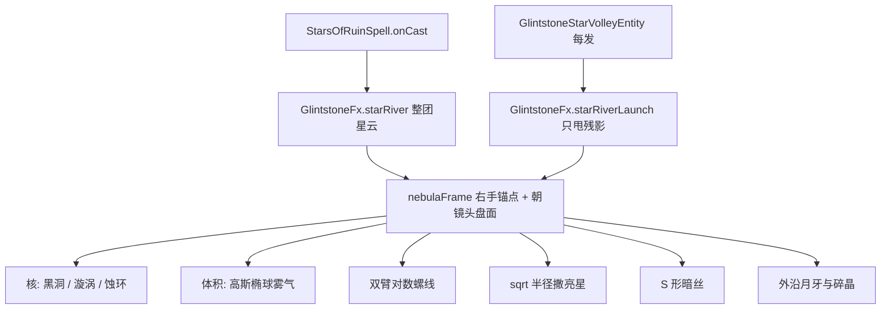

# 毁灭流星星云原理

本文说明毁灭流星（Stars of Ruin）的出手特效，如何从「沿视线拉一条粉尘螺旋」改成「右手前方、与头平齐的一团星云」，以及后续应该在哪里改位置、半径和密度。

## 一句话总结

星云不是随机撒粒子，也不是沿准星铺一条河。先把锚点偏到右手前面、锁在头部高度，再用一组解析函数（高斯椭球、对数螺线、S 形暗丝）把十六种预选贴图一层层铺上去；出手铺整团，齐射只从云里甩残影。

## 整体流程



涉及的主要文件：

- `src/main/java/com/eldenring/spells/particle/glintstone/GlintstoneFx.java` — 采样与分层生成
- `src/main/java/com/eldenring/spells/tuning/StarRiverTuning.java` — 位置、半径、螺线、密度
- `src/main/java/com/eldenring/spells/particle/starriver/StarRiverParticle.java` — 十六种贴图共用的寿命/淡出
- `src/main/java/com/eldenring/spells/registry/ModParticles.java`
- `src/main/java/com/eldenring/spells/EldenRingSpellsClient.java`
- `src/main/java/com/eldenring/spells/spell/StarsOfRuinSpell.java`
- `src/main/java/com/eldenring/spells/entity/GlintstoneStarVolleyEntity.java`
- `工具链/预选的粒子效果/` — 像素画源数据与 PNG
- `工具链/gen_star_river_particles.py` — 生成上述贴图

## 1. 为什么旧星河难看

旧实现沿视线做一条旋转螺旋，每个采样点刷原版 `DustParticleOptions` 方块粉尘，再点缀辉石闪星/光晕。问题有三：

1. **挡准星**：起点在眼睛，整条河铺在视野正中。
2. **没有结构**：螺旋只是一条线，没有核、臂、雾、星点的层次，看起来像脏雾带。
3. **配色错位**：辉石青闪星套在「毁灭流星」的深蓝紫主题上，和弹道对不上。

正确做法是把特效当成一块可阅读的星云：有核、有盘面、有旋臂、有点缀，并且放在镜头右侧、不抢准星。

## 2. 锚点：右手前面、与头平齐

锚点从眼睛出发，但**不用视线方向去拉长**。水平右 / 水平前把云送到杖头外侧，世界 Y 单独上移，低头抬头时云不会跟着砸进地面或糊脸。

```text
horizontalForward = normalize(look.x, 0, look.z)
horizontalRight   = horizontalForward × worldUp

center = eye
       + horizontalRight   × 0.58   // 右手外侧
       + horizontalForward × 0.42   // 手前面，不要进准星
       + worldUp           × 0.10   // 右手低于头，上移后与头平齐
```

数字在 `StarRiverTuning.ANCHOR_*`。调大右偏 → 更容易出画面；调小前偏 → 更靠近准星。

盘面本身另算一套**朝镜头**的轴，方便第一人称看见漩涡正面，而不是侧着一条线：

```text
diskRight = look × worldUp
diskUp    = diskRight × look
```

局部标架存在 `NebulaFrame(center, look, diskRight, diskUp)` 里，后面所有采样都在这个标架上做。

## 3. 用函数构造，不要随机糊一团

每一层对应一种几何，再把合适的贴图填进去。

### 3.1 核

固定铺在 `center`：

| 贴图 | 作用 |
|------|------|
| `void_core` | 近黑核，把中心压住 |
| `nebula_spiral` | 迷你双臂星系，一眼能读出「这是星云」 |
| `eclipse_ring` | 空心蚀环，给核一个轮廓 |
| `abyss_flare` | intensity ≥ 1.15 才出，出手闪光 |
| `pulse_ring` | intensity ≥ 1.45 才出，冲击波 |

核要少、要稳，不能和体积层抢密度。

### 3.2 体积：高斯椭球

三个独立高斯再裁到椭球内，得到蓬松、中心密、边缘稀的一团，而不是均匀方盒：

```text
offset = diskRight × clamp(N(0, 0.42), ±1.15) × radius
       + diskUp    × clamp(N(0, 0.42), ±1.15) × radius
       + look      × clamp(N(0, 0.28), ±0.90) × depth
```

`depth = radius × NEBULA_DEPTH_FRACTION`。调大 depth → 更「一团」；调小 → 更扁，像贴在右手旁的星盘。

填进去的是体积层，不是结构层：

- `star_river_mist` — 不规则星云团
- `star_river_glow` — 深靛辉光（半径略小，堆在更内侧）
- `twin_dust` — 左蓝右紫的软团，交界处挤白星

### 3.3 双臂对数螺线

两条臂相位差 `π`。半径不是线性拉长，而是对数生长，外圈张得更快，才像漩涡星系：

```text
t     = θ / θ_span                          // 0 → 1
r     = R × [ inner + (1 - inner) × (e^{k t} - 1) / (e^k - 1) ]
angle = θ + armIndex × π + gameTime × spin
pos   = center
      + diskRight × cos(angle) × r
      + diskUp    × sin(angle) × r
      + look      × sin(2 × angle) × weave
```

`gameTime` 让整朵云慢慢转；`weave` 让两臂不完全共面。采样点再叠一小团高斯抖动，臂才蓬，而不是一条细线。

沿臂切线给闪星和彗星残影一点速度，云会「流」而不是钉死。

### 3.4 亮星：半径取平方根

圆盘均匀采样必须 `r = R × sqrt(u)`，否则全堆在核里、外圈空。新星 / 双星 / 星团 / 闪星按这个分布点缀。

### 3.5 暗丝：S 曲线

参数 `along ∈ [-1, 1]`，主摆 + 二次谐波，不同丝错开相位：

```text
sway   = sin(along × π + phase) × 0.38
ripple = sin(along × 2.2π + phase × 1.7) × 0.12
```

`dark_filament` 是骨架，不是雾。数量要少。

### 3.6 外沿

月牙放在盘面左下沿，缺一块的辉光环像被吞掉的星云边。紫晶碎片带一点向外速度，做出「晶体从云里剥落」。

## 4. 贴图怎么进游戏

源数据在 `工具链/预选的粒子效果/`（JSON 像素画 + 32×32 PNG），由 `工具链/gen_star_river_particles.py` 生成。运行时用的是拷进 assets 的 PNG：

```text
assets/elden_ring_spells/textures/particle/<name>.png
assets/elden_ring_spells/particles/<name>.json
```

`void_mote` 是三帧动画（`void_mote_0/1/2`），其余单帧。

十六种贴图**共用** `StarRiverParticle`，用 `Kind` 区分寿命、尺寸、重力、淡出曲线，避免复制十六份几乎一样的 Provider。贴图本身已是深蓝 / 亮蓝 / 紫，粒子着色保持近白，不要再乘辉石青。

| Kind | 贴图 | 淡出 | 角色 |
|------|------|------|------|
| MIST | `star_river_mist` | 略胀再淡 | 体积 |
| GLOW | `star_river_glow` | 线性 | 体积内侧光 |
| DUST | `twin_dust` | 略胀再淡 | 蓝紫交界 |
| MOTE | `void_mote` | 正弦脉冲 | 闪星 |
| CORE | `void_core` | 线性 | 核 |
| SPIRAL | `nebula_spiral` | 线性 + 慢旋 | 核上的星系 |
| RING | `eclipse_ring` | 略胀 | 核轮廓 |
| FLARE | `abyss_flare` | 先胀后收 | 出手闪光 |
| PULSE | `pulse_ring` | 先胀后收 | 冲击波 |
| FILAMENT | `dark_filament` | 线性 | 骨架 |
| STREAK | `star_streak` | 线性，保留速度 | 沿臂 / 发射 |
| NOVA / BINARY / CLUSTER | 对应贴图 | 脉冲或线性 | 盘面亮星 |
| CRESCENT | `crescent_wake` | 线性 + 慢旋 | 外沿 |
| SHARD | `violet_shard` | 线性 + 自旋 + 重力 | 剥落 |

## 5. 出手一次，齐射只补发射感

毁灭流星会刷 12 发，间隔 2 tick。如果每发都重铺整团星云，粒子会叠成风暴。

| 时机 | API | 做什么 |
|------|-----|--------|
| `onCast` | `starRiver(level, caster, intensity, true)` | 核 + 体积 + 螺线 + 星 + 丝 + 沿 |
| 齐射每一发 | `starRiverLaunch(level, caster, intensity × 0.55)` | 只从核沿视线甩 `star_streak` / `void_mote`，偶发 `nova_star` |

`starRiverOrbit` 现在也走同一右手锚点，不再在胸口喷一条河。

服务端用 `MagicManager.spawnParticles` 同步到客户端。有方向速度时 `count = 0`（原版把 delta 当速度）；静止点用 `count = 1`，避免 0 个粒子被丢掉。

## 6. 改手感改哪里

只改 `StarRiverTuning`，不要在 `GlintstoneFx` 里写魔法数字。

| 观感 | 常量 |
|------|------|
| 太挡脸 / 太靠边 | `ANCHOR_RIGHT_OFFSET_BLOCKS`、`ANCHOR_FORWARD_OFFSET_BLOCKS` |
| 高低不对 | `ANCHOR_UP_OFFSET_BLOCKS` |
| 云太大 / 太小 | `NEBULA_RADIUS_BLOCKS` |
| 太扁 / 太圆 | `NEBULA_DEPTH_FRACTION` |
| 旋臂圈数、外张、转速 | `SPIRAL_THETA_SPAN_RADIANS`、`SPIRAL_GROWTH`、`SPIRAL_SPIN_RADIANS_PER_TICK` |
| 臂太细 | `ARM_SCATTER_FRACTION` |
| 整体疏密 | `*_COUNT_PER_INTENSITY` |
| 齐射残影多少 | `LAUNCH_STREAK_COUNT_PER_INTENSITY`、`LAUNCH_MOTE_COUNT_PER_INTENSITY` |

粒子单颗寿命和尺寸在 `StarRiverParticle.Kind`，和布局数字分开。

贴图要重画时：改 `工具链/gen_star_river_particles.py` → 跑脚本 → 把 PNG 再拷到 `textures/particle/`。不要把新脚本写到 `tools/` 或 `像素画/`。

## 7. 以后加同类特效时沿用什么

1. **先定锚点**，再定形状。特效不要默认从眼睛沿视线拉出去。
2. **用函数采样位置**，再用贴图填层。随机只作为抖动，不能当结构。
3. **一层一种职责**：核、体积、骨架、点缀、发射，不要一种粒子包打。
4. **持续事件不要每 tick 重铺整团**；主体一次生成，后续只补运动感。
5. **配色跟法术走**。毁灭流星用预选的蓝紫黑贴图，不要复用辉石青粒子库。
