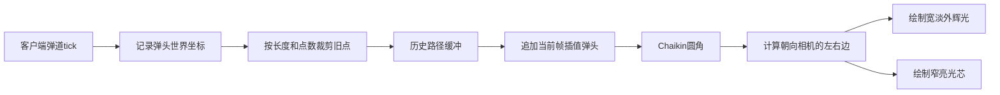

# 辉石曲线拖尾原理

本文说明本项目的辉石弹道拖尾是如何从“粒子烟雾”改造成“真实飞行曲线光带”的，以及后续应该在哪里调整长度、宽度和性能。

## 一句话总结

弹道在客户端每 tick 记录一次真实世界坐标，渲染时把这些历史点平滑后连接成一条始终朝向相机的自发光带状网格（ribbon），所以弹道转弯、上扬或绕轴旋转时，拖尾会保留实际经过的曲线。

它不是一串粒子，也不是弹头后面固定的一根直杆。

## 整体流程



涉及的主要文件：

- `src/main/java/com/eldenring/spells/entity/TrailHistoryBuffer.java`
- `src/main/java/com/eldenring/spells/entity/AbstractGlintstoneProjectile.java`
- `src/main/java/com/eldenring/spells/entity/SpiralShardProjectile.java`
- `src/main/java/com/eldenring/spells/client/render/glintstone/GlintstoneTrailRenderer.java`
- `src/main/java/com/eldenring/spells/client/render/glintstone/GlintstoneProjectileRenderer.java`
- `src/main/java/com/eldenring/spells/client/render/glintstone/SpiralShardRenderer.java`
- `src/main/java/com/eldenring/spells/tuning/GlintstoneTrailTuning.java`

## 1. 为什么不能只在弹头后面画一根直线

如果只使用弹头当前速度：

```text
尾端 = 弹头位置 - 当前方向 × 拖尾长度
```

无论弹道之前怎样拐弯，最终都只能得到一条直线。弹头每次转向时，整根直线还会像刚体一样瞬间旋转，无法表现“它刚才经过哪里”。

曲线拖尾必须保存时间信息：

```text
P0, P1, P2, ... Pn
```

其中 `P0` 是最旧位置，`Pn` 是最新位置。把相邻位置连接起来，才能还原真实飞行路径。

## 2. 客户端历史点如何保存

`TrailHistoryBuffer` 内部使用：

```java
ArrayDeque<Vec3>
```

按“最旧 → 最新”的顺序保存弹头世界坐标。

### 为什么只在客户端保存

这些点只影响画面，不参与：

- 伤害判定
- 碰撞判定
- 存档
- 服务端同步

服务端仍然只同步实体的位置和速度。每个客户端根据收到的弹道运动，自行生成视觉历史，避免网络包随着拖尾长度不断变大。

### 为什么不能每帧都无条件添加

若弹头移动很慢，连续点几乎重合，会产生大量零长度四边形。因此缓冲会忽略间距小于 `0.08` 方块的点。

若位置一次跳跃超过 `8` 方块，通常意味着传送或网络校正，此时会清空历史，避免从旧位置到新位置拉出一根跨地图长线。

### 为什么同时限制长度和点数

只限制点数时，高速弹道的实际拖尾会特别长；只限制距离时，慢速弹道又可能积累过多点。

所以每次记录后同时检查：

```text
历史点数 <= maximumHistoryPointCount
累计路径长度 <= lengthBlocks
```

超过限制就从最旧端逐点删除。

## 3. 当前帧为什么还要插值

历史点按游戏 tick 更新，而画面通常高于 20 FPS。如果渲染只使用最近 tick 的坐标，拖尾头部会落后弹头并出现间隙。

Renderer 会根据 `partialTicks` 计算当前帧弹头位置：

```text
current = lerp(partialTicks, 上一tick位置, 当前tick位置)
```

再把它追加到历史路径末端。这样光带始终贴住彗星本体。

## 4. 如何把折线变成平滑曲线

逐 tick 记录得到的是折线，旋飞魔砾每 tick 转过较大角度时尤其明显。

项目使用一次 Chaikin 圆角。对相邻点 `P0`、`P1` 生成：

```text
Q = 0.75 × P0 + 0.25 × P1
R = 0.25 × P0 + 0.75 × P1
```

将原折角替换为 `Q → R`，同时保留整条路径的首尾点。

选择 Chaikin 而不是高阶样条的原因：

1. 计算简单。
2. 不容易在急转弯处越过原路径。
3. 一次处理就能明显减弱双螺旋的多边形感。
4. 不需要服务端提供额外切线数据。

## 5. Ribbon 是怎样生成的

Minecraft 的普通几何线通常只有约一个像素宽，无法稳定表现可调粗细的辉石光带。因此这里使用带状四边形网格。

对每个路径点 `Pi`：

### 第一步：求轨迹切线

中间点使用前后两点：

```text
Ti = normalize(Pi+1 - Pi-1)
```

首尾点使用唯一相邻线段。

### 第二步：求朝向相机的横向向量

```text
Vi = CameraPosition - Pi
Si = normalize(Ti × Vi)
```

`Si` 同时垂直于轨迹方向和观察方向，因此用它展开的带状面会朝向相机。

若相机恰好位于轨迹正前方，叉乘接近零，则用世界上方向或 X 轴作为备用参考。

相邻点的 `Si` 若方向相反，会整体取负，避免 ribbon 在急弯处突然翻面。

### 第三步：计算左右边

```text
Lefti  = Pi - Si × Widthi
Righti = Pi + Si × Widthi
```

相邻两个点组成一个四边形：

```text
Lefti ---- Righti
  |           |
  |           |
Lefti+1 -- Righti+1
```

整条路径由这些连续四边形组成。

## 6. 为什么尾端会逐渐变细

先计算每个点距最旧端的累计路径长度，再归一化：

```text
progress = 当前累计长度 / 总长度
```

其中：

- `progress = 0`：最旧尾端
- `progress = 1`：当前弹头

半宽使用线性插值：

```text
width = lerp(progress, tailHalfWidth, headHalfWidth)
```

因此弹头附近较粗，最旧端较细，形成彗星收尖。

## 7. 光轨为什么看起来会发光

渲染使用：

```java
RenderType.entityTranslucentEmissive(TRAIL_BEAM_TEXTURE)
```

每个顶点还写入：

```java
LightTexture.FULL_BRIGHT
```

这意味着光轨不受环境明暗影响，在洞穴里仍然明亮。

但它只是视觉自发光，不会真正改变附近方块的光照等级。若要让地面和墙壁被实时照亮，需要额外兼容动态光源模组。

### 为什么不再使用 `RenderType.lightning()`

闪电 RenderType 适合硬边、加法混合的电弧。辉石拖尾使用它时容易看到交叉平面和塑料板状边缘。

当前方案使用自发光透明纹理：

`src/main/resources/assets/elden_ring_spells/textures/entity/glintstone/trail_beam.png`

纹理提供：

- 横向中心亮、两侧柔和透明。
- 弹头端较亮。
- 最旧尾端平滑淡出。

生成脚本位于：

`工具链/gen_glintstone_trail_texture.py`

## 8. 为什么画两层

每条曲线绘制两遍：

1. 外层：较宽、透明度较低，形成柔和蓝绿辉光。
2. 内层：较窄、透明度较高，形成清晰光芯。

两层共享相同路径，因此不会出现粒子拖尾常见的断点和烟团。

顶点颜色来自法术自身的 `VisualStyle`，所以彗星头与拖尾保持同一蓝绿色调。

## 9. 旋飞魔砾为什么需要特殊处理

普通弹道只有一条中心路径，一个 `TrailHistoryBuffer` 即可。

旋飞魔砾实际上有两颗彗星：

```text
Comet0 = Center + OrbitOffset(theta)
Comet1 = Center + OrbitOffset(theta + pi)
```

如果只记录中心实体，就只能画出中心轴线，无法得到双螺旋。

因此 `SpiralShardProjectile` 维护两个独立缓冲：

```java
TrailHistoryBuffer[2]
```

每 tick 分别记录两颗彗星的世界坐标，Renderer 再分别绘制两条 ribbon。

彗星本体方向也使用各自的瞬时切向速度，而不是中心轴速度，因此晶核、光轨和实际螺旋运动方向一致。

## 10. 飞行粒子怎样配合曲线光带

曲线光带仍然负责表现完整飞行路径。每个客户端 tick 会在“上一位置 → 当前位置”的真实位移线段上均匀抖动采样，按法术强度生成约 `3–6` 个粒子。粒子短暂存活后会自然铺满彗星刚刚飞过的轨迹，而不是只堆在弹头附近：

- 光晕：出现最频繁，形成柔和的能量残影。
- 薄雾：缩小后低概率出现，增加体积感但不遮挡光带。
- 火花与碎晶：沿反向飞行方向剥落，让轮廓更活跃。
- 闪星：最低频的高亮点缀。

此外，弹头后仍保留少量随机点缀，避免粒子轨迹与彗星头之间出现空隙。粒子密度随各法术的 `TRAIL_PARTICLE_INTENSITY` 递增，因此魔砾保持轻盈，辉石彗星和帚星更饱满；旋飞魔砾则会在两颗真实彗星的实际位移线上分别采样。

## 11. 性能为什么比密集粒子更可控

旧方式沿路径每隔一小段生成多个光晕、烟雾、火花粒子。每个粒子会存活多个 tick，并分别执行更新、透明度计算和渲染。

当前方式：

- 只采样当前 tick 的实际位移线段，不反复遍历整条历史轨迹。
- 每条历史路径只保存 `Vec3`。
- 每帧直接提交四边形顶点。
- 每颗彗星每 tick 最多采样 8 个轨迹粒子，避免极高强度造成无上限堆积。

若平滑后共有 `N` 个点：

```text
单层顶点数 = (N - 1) × 4
双层顶点数 = (N - 1) × 8
```

这是确定的上限，不会像长期存活的粒子一样跨 tick 堆积。

## 12. 各法术如何控制轨迹

每个法术的 `tuning/XxxTuning.java` 都有一份：

```java
GlintstoneTrailTuning.TrailStyle
```

字段含义：

- `lengthBlocks`：最长保留路径，单位方块。
- `headHalfWidthBlocks`：弹头端半宽。
- `tailHalfWidthBlocks`：最旧尾端半宽。
- `sparkChance`：每 tick 火花概率。
- `moteChance`：每 tick 闪星概率。
- `maximumHistoryPointCount`：历史最大点数。

当前大致层级：

- 辉石魔砾：约 8 方块 / 24 点。
- 迅魔砾：约 12 方块 / 32 点。
- 辉石流星：约 20 方块 / 40 点。
- 大魔砾：约 26 方块 / 48 点。
- 旋飞魔砾：每条约 32 方块 / 64 点。
- 辉石彗星：约 48 方块 / 72 点。
- 帚星：约 72 方块 / 96 点。

想让高级法术保留更完整的飞行路线，应优先增大 `lengthBlocks`；如果发现长度尚未达到设定值就被截断，再提高 `maximumHistoryPointCount`。

想让轨迹更粗，只调整头尾半宽，不要通过增加粒子数量实现。

## 13. 常见问题

### 光轨在转弯处翻面

检查相邻横向向量是否做点积。如果：

```text
dot(currentSide, previousSide) < 0
```

必须将当前向量取负。

### 光轨与弹头之间有缝

应确认 Renderer 追加的是 `partialTicks` 插值后的当前弹头，而不是最近一次历史 tick 坐标。

### 突然出现跨越很远的长线

通常是实体传送或网络校正。`TrailHistoryBuffer` 会在单次跳跃超过 8 方块时清空历史。

### 高级法术拖尾不够长

同时检查 `lengthBlocks` 和 `maximumHistoryPointCount`。任一限制先达到都会裁剪最旧点。

### 看得到发光，但周围方块没有变亮

这是正常现象。`FULL_BRIGHT` 是渲染亮度，不是世界光照传播。

## 14. 后续可扩展方向

1. 按速度或蓄力程度动态改变 ribbon 宽度。
2. 让 UV 随时间滚动，表现辉石能量沿轨迹流动。
3. 为不同学派换用不同的渐变纹理和颜色。
4. 对超长轨迹做视锥裁剪或降低远处采样密度。
5. 与动态光源 API 集成，让高级彗星短暂照亮附近地形。

